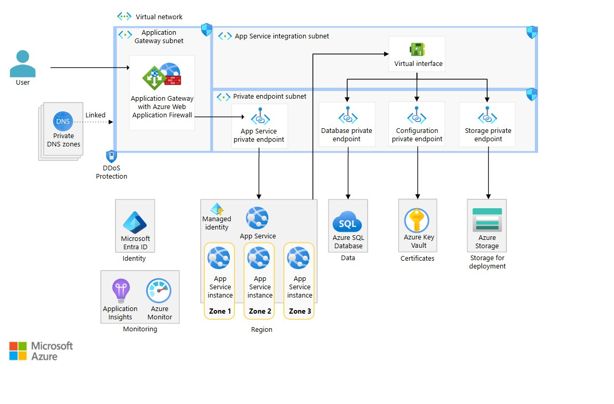

# Azure Infrastructure

This repository contains the **Infrastructure as Code (IaC)** for my Azure learning journey and final DevOps / Cloud Engineer practical assessment.

The objective is to learn Azure by understanding every service individually, deploying it manually, and then recreating the same infrastructure using Terraform.

The project follows **Microsoft Cloud Adoption Framework (CAF)** recommendations for resource organization, naming conventions, and tagging.

---

# Project Objective

The following diagram represents the **target architecture** that will be built throughout this project.



Rather than deploying everything at once, the architecture will be developed incrementally, with each Azure service studied, deployed manually, and finally automated using Terraform.

---

# Repository Structure

```text
azure-infrastructure/

│
├── docs/
│
├── learning/
│
├── modules/
│
└── final-project/
```

---

## learning/

Contains small Terraform exercises focused on **one Azure service at a time**.

```text
learning/

├── 01-app-service/
├── 02-storage/
├── 03-sql/
├── 04-keyvault/
├── 05-managed-identity/
└── ...
```

Each exercise contains:

- Terraform configuration
- README
- Variables
- Outputs
- Personal notes

The goal is to fully understand every Azure resource before moving to the next one.

---

## modules/

Reusable Terraform modules created from the learning exercises.

```text
modules/

├── app-service/
├── storage/
├── sql/
├── keyvault/
├── networking/
└── ...
```

Instead of copying Terraform code between projects, reusable modules will be created and later consumed by the final solution.

---

## final-project/

Contains the complete infrastructure required by the practical assessment.

```text
final-project/

├── main.tf
├── variables.tf
├── outputs.tf
├── terraform.tfvars
└── README.md
```

The project is assembled by combining the reusable Terraform modules developed during the learning phase.

---

# Learning Methodology

Every Azure service follows the same learning cycle.

```text
Study the Resource

↓

Deploy Manually

↓

Test & Validate

↓

Take Notes

↓

Delete Resources

↓

Recreate with Terraform

↓

Test & Validate

↓

Destroy

↓

Next Exercise
```

This methodology ensures that every Terraform resource is fully understood before being automated.

---

# Repository Architecture

## Application Repository

```text
GitHub

https://github.com/BredyByte/azure-hello-world-app

┌──────────────────────────────────────┐
│ azure-hello-world-app                │
│                                      │
│ Python Flask Application             │
│ GitHub Actions                       │
│ CI/CD Pipeline                       │
└──────────────────────────────────────┘
                │
                ▼
        Azure App Service
```

This repository contains only the application source code and its deployment pipeline.

---

## Infrastructure Repository

```text
GitHub

┌──────────────────────────────────────┐
│ azure-infrastructure                 │
│                                      │
│ Terraform                            │
│ Reusable Modules                     │
│ Learning Exercises                   │
│ Final Project                        │
└──────────────────────────────────────┘
                │
                ▼
        Azure Infrastructure
```

This repository contains only the Azure infrastructure managed with Terraform.

---

# Technologies

- Microsoft Azure
- Terraform
- Git
- GitHub
- GitHub Actions
- Python
- Flask

---

# Project Goals

- Learn Azure from first principles.
- Follow Microsoft CAF best practices.
- Master Infrastructure as Code using Terraform.
- Build reusable Terraform modules.
- Deploy applications through GitHub Actions.
- Assemble a secure, production-like Azure architecture.
