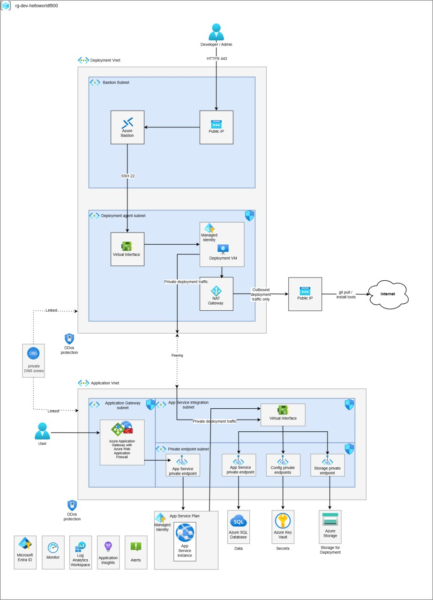

# Azure Hello World Infrastructure

This repository contains the Terraform configuration used to provision the Azure infrastructure for the **Azure Hello World learning project**.

The project was created to study Microsoft Azure, understand cloud architecture, and practise Infrastructure as Code with Terraform.

Application code and data delivery are managed in the companion repository:

[Azure Hello World Application](https://github.com/BredyByte/azure-hello-world-application)


## Project Overview

The project implements a security-focused Azure architecture for a small Python web application.

The infrastructure includes private networking, managed identities, private service connectivity, a controlled deployment environment, perimeter protection, and centralized monitoring.



The objective is not only to deploy the architecture, but to understand each Azure resource, its configuration, and its dependencies before automating it with Terraform.


## Project Goals

- Study the purpose and capabilities of core Azure services.
- Practise building modular infrastructure with Terraform.
- Understand dependencies between networking, identity, services, and application delivery.
- Compare manual Azure Portal deployments with automated Terraform deployments.
- Apply consistent resource naming and tagging.
- Implement private connectivity for Azure platform services.
- Use managed identities and Azure RBAC instead of stored credentials.
- Protect the public application entry point with Application Gateway and WAF.
- Collect Application Gateway access and firewall logs in Log Analytics.
- Build infrastructure that can be validated, destroyed, and recreated.


## Learning Methodology

Each infrastructure layer followed the same learning process:

```text
Study the Azure resource
        ↓
Understand its capabilities and configuration
        ↓
Identify dependencies with other resources
        ↓
Deploy it manually through Azure Portal
        ↓
Test and validate the manual deployment
        ↓
Implement it as a Terraform module
        ↓
Run Terraform plan and apply
        ↓
Test and validate the automated deployment
        ↓
Integrate it with the complete architecture
```

This process made it possible to understand what Terraform was creating instead of treating the infrastructure as a single deployment template.


## Project Repositories

The project is separated into two repositories with different responsibilities.

### Infrastructure repository

[azure-hello-world-infrastructure](https://github.com/BredyByte/azure-hello-world-infrastructure)

Responsible for:

- Provisioning Azure resources.
- Configuring networking and private connectivity.
- Creating managed identities and RBAC assignments.
- Configuring Application Gateway and WAF.
- Enabling centralized monitoring.

### Application repository

[azure-hello-world-application](https://github.com/BredyByte/azure-hello-world-application)

Responsible for:

- Deploying the Python application to Azure App Service.
- Creating the Azure SQL schema and initial data.
- Uploading application content to Blob Storage.
- Adding application secrets to Azure Key Vault.
- Validating the deployed application data.

The application repository assumes that the Azure infrastructure has already been provisioned with Terraform.


## Terraform Workflow

### 1. Generate the SSH key pair

The deployment VM uses SSH key authentication.

Generate the key pair before running Terraform:

```bash
ssh-keygen \
  -t ed25519 \
  -f ~/.ssh/azure_hello_world_deployment
```

### 2. Create the Terraform variables file

The repository contains a safe configuration template:

```text
terraform.tfvars.example
```

Copy it to create the local variables file, and complete it:

```bash
cp terraform.tfvars.example terraform.tfvars
```

The real `terraform.tfvars` file is local and is not stored in Git.

### 3. Initialize and validate Terraform

```bash
terraform init
terraform fmt -recursive
terraform validate
```

### 4. Review the infrastructure plan

```bash
terraform plan -out=tfplan
```

### 5. Provision the infrastructure

```bash
terraform apply tfplan
```

### 6. Review the Terraform outputs

```bash
terraform output
```

### 7. Destroy the learning environment

Destroy the infrastructure when it is no longer required:

```bash
terraform destroy
```


## Application Deployment Workflow

After Terraform provisions the infrastructure, application delivery is performed from the private deployment VM.

The deployment VM has:

- No public IP address.
- Private access through Azure Bastion.
- Outbound internet access through the NAT Gateway.
- Private connectivity to the application services.
- A system-assigned managed identity.
- Azure RBAC permissions assigned by Terraform.

The managed identity allows the deployment scripts to access Azure resources without storing Azure credentials in the repository.

The following diagram illustrates the complete application deployment workflow:


### 1. Connect to the deployment VM

Open Azure Portal and navigate to:

```text
Virtual Machines
→ vm-deployment-agent-dev-helloworldf800
→ Connect
→ Bastion
```

Select SSH private key authentication and use:

```text
~/.ssh/azure_hello_world_deployment
```

### 2. Clone the application repository

Inside the deployment VM:

```bash
git clone \
  https://github.com/BredyByte/azure-hello-world-application.git
```

### 3. Install Make

```bash
sudo apt update
sudo apt install -y make
```

### 4. Deploy the application and data

Run:

```bash
make deploy
```

### 5. Validate the deployed data

Run all data validation checks:

```bash
make check
```

This validates:

- The secret stored in Azure Key Vault.
- The content uploaded to Blob Storage.
- The schema and data created in Azure SQL Database.

### 6. Access the application

The App Service has public network access disabled. Application Gateway is the only public entry point to the application.

To find its public IP address in Azure Portal, navigate to:

```text
Application Gateways
→ agw-dev-helloworldf800
→ Overview
→ Frontend public IP address
```

The public IP address is also available in the Terraform outputs:

```bash
terraform output edge_gateway
```
